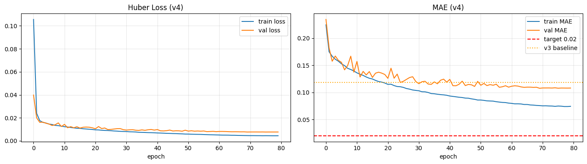
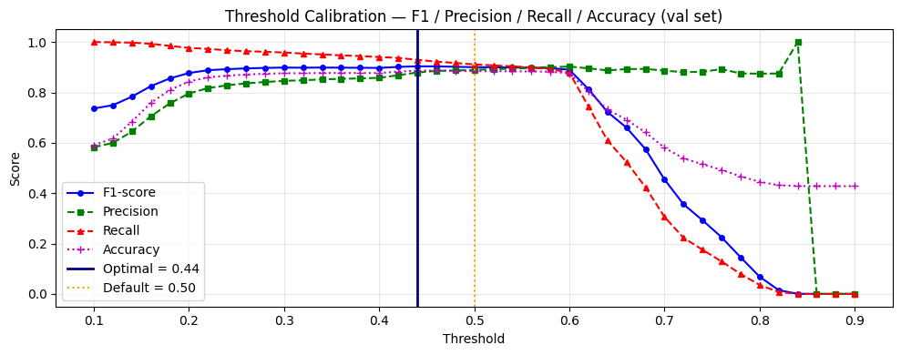
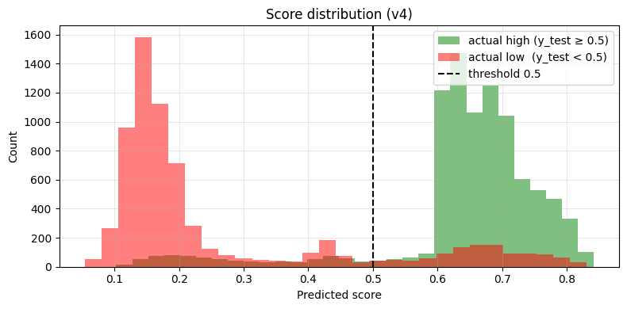
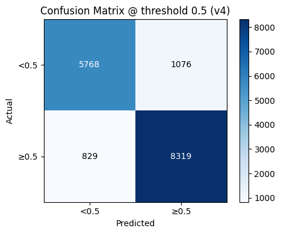
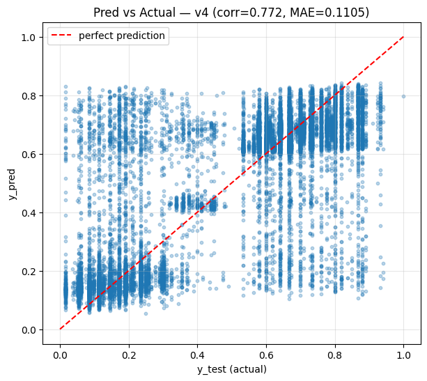

<div align="right">
  <strong>🇬🇧 English</strong> | <a href="README.id.md">🇮🇩 Bahasa Indonesia</a>
</div>

# SkillAlign AI Service

<div align="center">

**Deep Learning & NLP-based CV-Job Matching Engine**

*Capstone Project — DBS Foundation Coding Camp 2026 · Team CC26-PSU318*

[](https://python.org)
[](https://tensorflow.org)
[](https://keras.io)
[](https://fastapi.tiangolo.com)
[](https://cloud.google.com/run)
[](https://supabase.com)

[](notebooks/plots_v4/threshold_calibration.png)
[](notebooks/plots_v4/cm_v4.png)
[](README.md)

</div>

---

## Table of Contents

- [Overview](#-overview)
- [Live Service](#-live-service)
- [Model Architecture](#-model-architecture)
- [System Architecture](#-system-architecture)
- [Project Structure](#-project-structure)
- [Setup & Installation](#-setup--installation)
- [Environment Variables](#-environment-variables)
- [Running the Service](#-running-the-service)
- [Docker & Deployment](#-docker--deployment)
- [API Reference](#-api-reference)
- [Request & Response Examples](#-request--response-examples)
- [Performance Metrics](#-performance-metrics)
- [Training Pipeline](#-training-pipeline)
- [Supabase Setup](#-supabase-setup)
- [Known Limitations](#-known-limitations)
- [Team](#-team)

---

## 📋 Overview

SkillAlign AI Service is a **Deep Learning-based scoring engine** for **CV-Job Matching**. The service accepts a CV text and a job description, then produces a match score (0.0–1.0) along with skill gap analysis, candidate profile extraction, and personalized learning path recommendations.

It acts as the **AI backend** consumed by a Node.js/Express backend in a **Two-Stage Retrieval + Re-Ranking** pipeline:

```
User Request → Backend (Express.js)
                    │
          ┌─────────┴────────────┐
          │  Stage 1: Retrieve   │  ← PostgreSQL full-text / vector search
          │  (top-K candidates)  │
          └─────────┬────────────┘
                    │
          ┌─────────┴────────────┐
          │  Stage 2: Re-Rank    │  ← SkillAlign AI Service (this repo)
          │  (neural scoring)    │
          └─────────┬────────────┘
                    │
              Final Ranked Results
```

### Key Features

| Feature | Description | Endpoint |
|---|---|---|
| **CV-Job Matching** | Match score 0.0–1.0 (neural + structured features) | `/predict`, `/api/v1/predict` |
| **Batch Scoring** | 1 CV vs up to 50 jobs, ranked by score | `/api/v1/predict/batch` |
| **Skill Gap Analysis** | Detect skills present vs. missing for a target role | `/api/v1/skill-gap` |
| **Extract CV Skills** | Extract skill list from CV text only | `/api/v1/extract-cv-skills` |
| **Analyze CV** | Candidate profile (role, experience, education) + job title suggestions | `/api/v1/analyze-cv` |
| **Recommend Jobs** | Ranked job postings + industry skill readiness analysis | `/api/v1/recommend` |
| **Learning Path** | Personalized study plan per skill (Gemini 2.5 Flash + YouTube + Supabase cache) | `/api/v1/learning-path/...` |

### Tech Stack

| Layer | Technology |
|---|---|
| **API Framework** | FastAPI 0.104 + Uvicorn |
| **ML Framework** | TensorFlow 2.15 / Keras 3.13 |
| **NLP** | NLTK, Gensim Word2Vec, KeyBERT, SentenceTransformers |
| **Skill Extraction** | CsvSkillExtractor (rule-based, ~685 job types, ~3000+ skills) |
| **AI / LLM** | Gemini 2.5 Flash via REST (Search Grounding) |
| **Video API** | YouTube Data API v3 |
| **Cache / DB** | Supabase (PostgreSQL) |
| **Containerization** | Docker, Google Cloud Build |
| **Hosting** | Google Cloud Run |

---

## 🌐 Live Service

The service is independently deployed on **Google Cloud Run** by each team member.

| Member | Region | Health Check |
|---|---|---|
| Destian | asia-southeast2 (Jakarta) | `GET <URL>/health` |
| Zahri | asia-southeast1 (Singapore) | `GET <URL>/health` |

> To get the URL: `gcloud run services describe skillalign-ai --region <region>`

Health check response:
```json
{ "status": "healthy", "model_loaded": true, "model_version": "v4", "optimal_threshold": 0.44 }
```

---

## 🏗️ Model Architecture

### Model v4 — SkillAlignMatcherV4 (Active in Production)

The core model uses a **Multi-Scale CNN + Cross-Attention** architecture:

```
cv_input (seq_len=300)                   job_input (seq_len=300)
        │                                         │
        └──── Shared Embedding Layer ─────────────┘
              (vocab=15,000 · dim=128 · pre-trained Word2Vec)
                       │                       │
          ┌────────────┼────────────┐           │  (same for job)
     Conv1D(256)  Conv1D(256)  Conv1D(256)      │
     kernel=2     kernel=3     kernel=5         │
     SpatialDropout1D(0.3)                      │
     L2 regularization (1e-4)                   │
          └────────────┼────────────┘           │
            GlobalMaxPool1D × 3 branches        │
            Concat → 768-dim repr              768-dim repr
                       │                         │
                       └──── CrossAttentionLayer ─┘
                                    │
                             Dense(256, relu)
                             Dropout(0.4)
                             Dense(128, relu)
                             Dropout(0.3)
                             Dense(64, relu)
                             Dense(1, sigmoid)
                                    │
                           matching_score (0.0–1.0)
```

**Training Configuration:**

| Parameter | Value |
|---|---|
| Vocab size | 15,000 tokens |
| Embedding dim | 128 (pre-trained Word2Vec) |
| Sequence length | 300 tokens |
| CNN kernels | k=2, k=3, k=5 (256 filters each) |
| Loss function | Huber Loss (δ=0.1) |
| Learning rate | Cosine Annealing (η_max=1.374e-3, T_max=80) |
| Epochs | 80 |
| Batch size | 64 |
| Optimal threshold | **0.44** (calibrated via F1-sweep) |

### HybridScorer

Inference combines neural score with structured features:

```
final_score = α × neural_score + (1 − α) × structured_score

α = 0.40  →  when structured features are available
α = 0.15  →  when only neural score is available (plain text)
```

---

## 🔧 System Architecture

```
                         ┌─────────────────────────────────────────┐
                         │          SkillAlign AI Service           │
                         │              (FastAPI)                   │
                         │                                          │
  HTTP Request  ────────►│  /predict          → SkillAlignPredictor │
                         │  /api/v1/predict        + HybridScorer   │
                         │  /api/v1/predict/batch                   │
                         │                                          │
                         │  /api/v1/skill-gap  → CsvSkillExtractor  │
                         │  /api/v1/extract-cv-skills  (rule-based) │
                         │                                          │
                         │  /api/v1/analyze-cv → CvProfileExtractor │
                         │  /api/v1/recommend  → IndustryAnalyzer   │
                         │                                          │
                         │  /api/v1/learning-path/* → CourseFinder  │
                         │                            (Gemini REST)  │
                         └───────────┬──────────────────────────────┘
                                     │
                    ┌────────────────┼────────────────┐
                    │                │                │
               ┌────▼────┐    ┌──────▼──────┐  ┌─────▼──────┐
               │ TF/Keras │    │  Gemini 2.5  │  │  Supabase  │
               │ Model v4 │    │  Flash REST  │  │  (Cache)   │
               └──────────┘    └─────────────┘  └────────────┘
```

### Skill Extraction (v7 — CSV Rule-Based)

`CsvSkillExtractor` replaces SkillNer entirely:

```
Input text
    │
    ▼
Load job_skill_map.csv (~685 job types)
    │  ← skills_core | skills_common | skills_optional | soft_skills
    ▼
Deduplicate all skills → sort by length DESC (longer match first)
    │
    ▼
Pre-compile regex patterns (custom word boundary: handles C#, .NET, C++)
    │
    ▼
Scan text → greedy match → overlap prevention
    │
    ▼
Dict[skill_id → (skill_name, confidence=1.0)]
```

**Advantages over SkillNer:**
- No spaCy dependency (~800MB lighter Docker image)
- Instant startup, sub-65ms per request
- No cold start lag
- Thread-safe (pure Python regex, no Cython concurrency issues)

---

## 📁 Project Structure

```
SkillAlign-AI-Service/
├── src/
│   ├── database/
│   │   ├── supabase_client.py          # Singleton Supabase client + cache helpers
│   │   └── job_skill_map.csv           # ~685 job types, ~3000+ skills (4 columns)
│   ├── inference/
│   │   ├── predict.py                  # SkillAlignPredictor + HybridScorer
│   │   ├── api_service.py              # FastAPI router
│   │   ├── skill_gap.py                # SkillGapAnalyzer v7 (wraps CsvSkillExtractor)
│   │   ├── csv_skill_extractor.py      # Rule-based skill extractor (regex)
│   │   ├── learning_path_router.py     # Learning path endpoints
│   │   ├── course_finder.py            # CourseFinder via Gemini 2.5 Flash REST
│   │   ├── cv_profile_extractor.py     # CV profile extraction (role, exp, education)
│   │   ├── job_title_suggester.py      # Job title suggestions from CV skills
│   │   ├── industry_skill_analyzer.py  # Skill readiness vs. industry analysis
│   │   ├── hybrid_scorer.py            # HybridScorer (neural + structured)
│   │   └── role_config.py              # Role & skill mapping configuration
│   ├── models/
│   │   ├── model_architecture.py       # SkillAlignMatcherV4 (Multi-Scale CNN)
│   │   ├── custom_layers.py            # CrossAttentionLayer
│   │   ├── custom_loss.py              # Huber + auxiliary losses
│   │   └── custom_callbacks.py         # F1-sweep callback, LR scheduler
│   ├── preprocessing/
│   │   ├── nlp_preprocessor.py         # Tokenizer + Lemmatizer (NLTK-based)
│   │   ├── feature_engineering.py      # TF-IDF, structured features
│   │   ├── embeddings.py               # Word2Vec embedding manager (Gensim)
│   │   └── pair_synthesizer.py         # 5-mode data synthesis for training
│   ├── training/
│   │   ├── train.py                    # Training pipeline entry point
│   │   ├── custom_training_loop.py     # tf.GradientTape training loop
│   │   └── hyperparameter_tuning.py    # Keras Tuner integration
│   └── utils/
│       ├── metrics.py                  # Custom metrics (F1-sweep)
│       ├── error_handling.py           # Exception handlers
│       ├── validation.py               # Input validation helpers
│       └── visualization.py            # Confusion matrix, training curves
├── models/
│   ├── skillalign_matcher_v4.keras     # Model v4 — active in production
│   └── model_config_v4.json            # Model v4 configuration
├── preprocessors/
│   ├── nlp_preprocessor_v4.pkl         # Tokenizer + vocab v4
│   └── embedding_manager_v4.pkl        # Word2Vec weights v4
├── notebooks/
│   ├── 02U_model_development.ipynb     # Training pipeline v4 (Google Colab)
│   └── plots_v4/                       # Training visualizations
├── scripts/
│   └── supabase_migrations.sql         # DDL for skill_courses & learning_path_sessions
├── Dockerfile                          # ~2.5GB final image
├── .gcloudignore                       # Reduces build context: ~60MB (from 573MB)
├── .env.example                        # Environment variables template
├── main.py                             # FastAPI entry point + lifespan
└── requirements.txt                    # Python dependencies
```

---

## ⚙️ Setup & Installation

### Prerequisites

- Python 3.11 (recommended)
- Git
- Docker (optional, for containerized run)
- `gcloud` CLI (optional, for Cloud Run deployment)

### 1. Clone & Virtual Environment

```bash
git clone https://github.com/DeAlNu/SkillAlign-AI-Service.git
cd SkillAlign-AI-Service

# Create virtual environment
python -m venv venv

# Activate (Windows)
.\venv\Scripts\activate

# Activate (Linux/Mac)
source venv/bin/activate
```

### 2. Install Dependencies

```bash
pip install -r requirements.txt
```

> **Note:** No spaCy model download needed. `CsvSkillExtractor` is pure Python — no spaCy/SkillNer dependency.

NLTK data downloads automatically on first run. To pre-download manually:

```bash
python -c "import nltk; nltk.download('wordnet'); nltk.download('stopwords'); nltk.download('punkt'); nltk.download('averaged_perceptron_tagger')"
```

### 3. Environment Variables

```bash
cp .env.example .env
```

Edit `.env`:

```env
# Model
MODEL_PATH=models/skillalign_matcher_v4.keras
PREPROCESSOR_PATH=preprocessors/nlp_preprocessor_v4.pkl
CONFIG_PATH=models/model_config_v4.json
OPTIMAL_THRESHOLD=0.44
USE_HYBRID=true

# Gemini API (Google AI Studio — https://aistudio.google.com)
GEMINI_API_KEY=your_gemini_api_key_here

# YouTube Data API v3
YOUTUBE_API_KEY=your_youtube_api_key_here

# Supabase
SUPABASE_URL=https://your-project-id.supabase.co
SUPABASE_SERVICE_ROLE_KEY=your_service_role_key_here
```

> ⚠️ Never commit `.env` — it's already in `.gitignore`.

---

## 🔧 Environment Variables

| Variable | Required | Default | Description |
|---|---|---|---|
| `MODEL_PATH` | ✅ | — | Path to `.keras` model file |
| `PREPROCESSOR_PATH` | ✅ | — | Path to `.pkl` NLP preprocessor |
| `CONFIG_PATH` | — | — | Path to `model_config_v4.json` |
| `OPTIMAL_THRESHOLD` | — | `0.44` | Binary classification threshold |
| `USE_HYBRID` | — | `true` | Enable HybridScorer (neural + structured) |
| `GEMINI_API_KEY` | ✅* | — | Gemini 2.5 Flash key (Google AI Studio) |
| `YOUTUBE_API_KEY` | ✅* | — | YouTube Data API v3 key |
| `SUPABASE_URL` | ✅* | — | Supabase project URL |
| `SUPABASE_SERVICE_ROLE_KEY` | ✅* | — | Supabase service role key (not anon key) |

> *Optional if not using `/api/v1/learning-path/*` endpoints.

---

## 🚀 Running the Service

```bash
# With hot-reload (development)
uvicorn main:app --host 0.0.0.0 --port 8000 --reload
```

Service is ready when logs show:
```
INFO:     ✅ Model v4 loaded | threshold=0.44 | hybrid=ON
INFO:     Application startup complete.
```

**Swagger UI:** http://localhost:8000/docs

**TensorBoard:**
```bash
tensorboard --logdir=logs/training_v4
# Open: http://localhost:6006
```

---

## 🐳 Docker & Deployment

### Build & Run Locally

```bash
docker build -t skillalign-ai .
docker run -p 8000:8000 --env-file .env skillalign-ai
```

### Deploy to Google Cloud Run

```bash
PROJECT_ID="your-gcp-project-id"
REGION="asia-southeast1"
REPO="your-artifact-registry-repo"
IMAGE="${REGION}-docker.pkg.dev/${PROJECT_ID}/${REPO}/skillalign-ai:latest"

# Build via Cloud Build (~15-20 min first build)
gcloud builds submit --tag $IMAGE --timeout=30m --project=$PROJECT_ID .

# Deploy
gcloud run deploy skillalign-ai \
  --image $IMAGE \
  --region $REGION \
  --memory 4Gi \
  --cpu 2 \
  --timeout 300 \
  --min-instances 0 \
  --max-instances 3 \
  --set-env-vars "MODEL_PATH=models/skillalign_matcher_v4.keras" \
  --set-env-vars "PREPROCESSOR_PATH=preprocessors/nlp_preprocessor_v4.pkl" \
  --set-env-vars "OPTIMAL_THRESHOLD=0.44" \
  --set-env-vars "USE_HYBRID=true" \
  --set-env-vars "GEMINI_API_KEY=YOUR_KEY" \
  --set-env-vars "YOUTUBE_API_KEY=YOUR_KEY" \
  --set-env-vars "SUPABASE_URL=YOUR_URL" \
  --set-env-vars "SUPABASE_SERVICE_ROLE_KEY=YOUR_KEY" \
  --allow-unauthenticated \
  --project $PROJECT_ID
```

> `$PORT` is injected automatically by Cloud Run (8080). Dockerfile uses `${PORT:-8000}` as fallback.

---

## 📡 API Reference

| Method | Endpoint | Description | Needs Model? |
|---|---|---|---|
| GET | `/` | Service info & model status | — |
| GET | `/health` | Health check | — |
| POST | `/predict` | Single CV vs 1 Job | ✅ |
| POST | `/api/v1/predict` | Single CV vs 1 Job (versioned) | ✅ |
| POST | `/api/v1/predict/batch` | 1 CV vs ≤50 Jobs, ranked | ✅ |
| POST | `/api/v1/skill-gap` | Skill gap analysis CV vs Job | ❌ |
| POST | `/api/v1/extract-cv-skills` | Extract skills from CV text | ❌ |
| POST | `/api/v1/analyze-cv` | Candidate profile + job title suggestions | ❌ |
| POST | `/api/v1/recommend` | Ranked jobs + industry skill analysis | ✅ |
| POST | `/api/v1/learning-path/analyze` | Study plan per skill (Gemini + YouTube) | ❌ |
| POST | `/api/v1/learning-path/refresh` | Refresh course cache for a skill | ❌ |
| GET | `/api/v1/learning-path/courses/{skill}` | Get cached courses from Supabase | ❌ |

### Confidence & Recommendation Mapping

| Score | Confidence | Recommendation |
|---|---|---|
| ≥ 0.70 | High | Highly Recommended |
| 0.44 – 0.69 | Medium | Consider |
| < 0.44 | Low | Not Recommended |

---

## 📊 Request & Response Examples

### Health Check

```bash
curl https://your-service-url.run.app/health
```
```json
{ "status": "healthy", "model_loaded": true, "model_version": "v4", "optimal_threshold": 0.44 }
```

### Single Predict

```bash
curl -X POST https://your-service-url.run.app/predict \
  -H "Content-Type: application/json" \
  -d '{
    "cv_text": "Experienced Data Scientist with 5 years in Python, TensorFlow, and machine learning. Deployed 10+ production ML models.",
    "job_description": "Looking for a Data Scientist with Python, TensorFlow, and ML deployment experience."
  }'
```
```json
{
  "matching_score": 0.81,
  "confidence": "High",
  "recommendation": "Highly Recommended",
  "inference_time_ms": 53.4
}
```

### Batch Predict

```bash
curl -X POST https://your-service-url.run.app/api/v1/predict/batch \
  -H "Content-Type: application/json" \
  -d '{
    "cv_text": "Data Scientist with Python, TensorFlow, machine learning, and NLP experience.",
    "job_descriptions": [
      "Senior Data Scientist — Python, TensorFlow, ML deployment required.",
      "Digital Marketing Manager — SEO, Google Ads, content strategy.",
      "Frontend Developer — React.js, TypeScript, REST APIs."
    ]
  }'
```
```json
{
  "results": [
    { "rank": 1, "job_index": 0, "matching_score": 0.83, "confidence": "High", "recommendation": "Highly Recommended" },
    { "rank": 2, "job_index": 2, "matching_score": 0.22, "confidence": "Low",  "recommendation": "Not Recommended" },
    { "rank": 3, "job_index": 1, "matching_score": 0.17, "confidence": "Low",  "recommendation": "Not Recommended" }
  ],
  "total_items": 3,
  "total_time_ms": 298.7
}
```

### Skill Gap Analysis

```bash
curl -X POST https://your-service-url.run.app/api/v1/skill-gap \
  -H "Content-Type: application/json" \
  -d '{
    "cv_text": "Data Analyst with SQL, Excel, PowerBI, and basic Python.",
    "job_description": "Data Scientist requiring Python, machine learning, TensorFlow, and deep learning."
  }'
```
```json
{
  "skill_gap_score": 0.33,
  "skill_coverage_percent": "33%",
  "top_priority_skill": "machine learning",
  "present_skills": [
    { "skill": "python", "skill_id": "python", "match_score": 1.0 },
    { "skill": "sql",    "skill_id": "sql",    "match_score": 1.0 }
  ],
  "missing_skills": [
    { "skill": "machine learning", "skill_id": "machine_learning", "match_score": 0.0, "priority": 1 },
    { "skill": "tensorflow",       "skill_id": "tensorflow",       "match_score": 0.0, "priority": 2 },
    { "skill": "deep learning",    "skill_id": "deep_learning",    "match_score": 0.0, "priority": 3 }
  ],
  "recommendation_summary": "Skill match: 33% (needs improvement). Prioritize learning: machine learning, tensorflow, deep learning.",
  "analysis_time_ms": 41.2
}
```

---

## 📈 Performance Metrics

### Model v4 (Active in Production)

| Metric | Value |
|---|---|
| **F1-Score** (threshold=0.44) | **0.9036** |
| **Accuracy** (threshold=0.44) | **88.65%** |
| Precision | 0.8792 |
| Recall | 0.9293 |
| MAE (regression) | 0.1105 |
| RMSE | 0.1783 |
| Pearson Correlation | 0.772 |
| Best Val MAE (epoch 70/80) | 0.10766 |
| Optimal threshold | **0.44** |

---

### Training Curves

> Huber Loss and MAE converge stably over 80 epochs without overfitting — train/val loss tracks closely throughout training.



---

### Threshold Calibration

> Threshold 0.44 was selected via F1-sweep on the validation set — not hardcoded at 0.5. The chart shows the F1 maximum (solid blue vertical line) vs. the default 0.5 (dotted orange line).



---

### Score Distribution

> Clear bimodal distribution between "match" pairs (green, high scores) and "no match" pairs (red, low scores) — evidence that the model learned to separate both classes effectively.



---

### Confusion Matrix & Prediction Quality

<div align="center">

| Confusion Matrix (threshold=0.5) | Prediction vs Actual |
|:---:|:---:|
|  |  |

</div>

> **Confusion Matrix:** Out of ~16,000 test samples, false negatives (829) are far fewer than true positives (8,319) — the model rarely misses genuinely matching candidates.  
> **Pred vs Actual:** Points follow the diagonal (perfect prediction line) with correlation 0.772 — the model learned the continuous label distribution, not just binary classification.

---

### Inference Time (Cloud Run, warm instance)

| Endpoint | Latency |
|---|---|
| `/predict` (single) | ~50–80ms |
| `/api/v1/predict/batch` (10 jobs) | ~300–400ms |
| `/api/v1/skill-gap` | **~40–65ms** (CSV-based, no cold start) |
| `/api/v1/extract-cv-skills` | ~10–20ms |
| `/api/v1/analyze-cv` | ~80–120ms |
| `/api/v1/learning-path/analyze` (cache hit) | ~800–1200ms |
| `/api/v1/learning-path/analyze` (cache miss) | ~3–8s (Gemini API call) |

> Cold start (from 0 instances): ~8–15s for TensorFlow model to load into memory. Use `--min-instances 1` to avoid cold starts in production.

---

## 🎯 Training Pipeline

### Data

- Dataset: LinkedIn job postings + resume matching pairs (US market)
- Labels: continuous 0.0–1.0 (regression, not binary classification)
- Data synthesis: 5-mode pair synthesizer for augmentation

```
Raw LinkedIn Data
       │
       ▼
NLP Preprocessing (NLTK: tokenize, lemmatize, stopword removal)
       │
       ▼
Word2Vec Training (Gensim, dim=128, window=5, min_count=2)
       │
       ▼
Pair Synthesis (5 modes: positive, hard/soft negative, cross-domain, seniority)
       │
       ▼
Model Training (SkillAlignMatcherV4, 80 epochs, Huber Loss)
       │
       ▼
F1-Sweep Threshold Calibration → optimal_threshold = 0.44
       │
       ▼
Export: .keras + .pkl (preprocessor) + .json (config)
```

---

## 🗄️ Supabase Setup

The Learning Path feature uses Supabase to cache course recommendations (30-day TTL).

```sql
-- Run in Supabase Dashboard → SQL Editor
-- Full file: scripts/supabase_migrations.sql

CREATE TABLE IF NOT EXISTS skill_courses (
  id           BIGSERIAL PRIMARY KEY,
  skill_name   TEXT NOT NULL,
  course_data  JSONB NOT NULL,
  created_at   TIMESTAMPTZ NOT NULL DEFAULT NOW()
);

CREATE INDEX IF NOT EXISTS idx_skill_courses_skill_name ON skill_courses(skill_name);
CREATE INDEX IF NOT EXISTS idx_skill_courses_created_at ON skill_courses(created_at);

CREATE TABLE IF NOT EXISTS learning_path_sessions (
  id           BIGSERIAL PRIMARY KEY,
  user_id      TEXT NOT NULL,
  session_data JSONB NOT NULL,
  created_at   TIMESTAMPTZ NOT NULL DEFAULT NOW()
);
```

**Cache strategy:**
- **Cache hit:** skill exists in `skill_courses` and `created_at` < 30 days → return from Supabase (~50ms)
- **Cache miss:** call Gemini API → store in Supabase → return (~3–8s)
- **Refresh:** `/learning-path/refresh` deletes old cache and regenerates

---

## ⚠️ Known Limitations

| Aspect | Limitation |
|---|---|
| **Geography** | Trained on LinkedIn US data — may be less accurate for Indonesian job market context |
| **Industry** | Heavy representation of IT, Healthcare, Finance — logistics/manufacturing/agriculture underrepresented |
| **Language** | English input only — Indonesian language input results in many OOV tokens and reduced accuracy |
| **Skill Coverage** | `CsvSkillExtractor` only recognizes ~3,000+ skills in `job_skill_map.csv` — niche or emerging skills may not be detected |
| **Cold Start** | First instance after idle needs ~8–15s to load TensorFlow model — use `min-instances 1` to mitigate |
| **Gemini Quota** | Gemini 2.5 Flash has rate limits on the free tier — avoid bursting many skill requests simultaneously |
| **YouTube API** | YouTube Data API v3 has a 10,000-unit daily quota — monitor usage in GCP Console |
| **Batch Limit** | `/api/v1/predict/batch` is capped at 50 job descriptions per request |

---

## 👥 Team

| Name | Role |
|---|---|
| **Zahri Ramadhani** | AI Engineer |
| **Destian Aldi Nugraha** | AI Engineer |

**Capstone Project** — DBS Foundation Coding Camp 2026  
**Team ID:** CC26-PSU318

---

## 📄 License

Capstone Project — DBS Foundation Coding Camp 2026.  
Not for commercial distribution.
